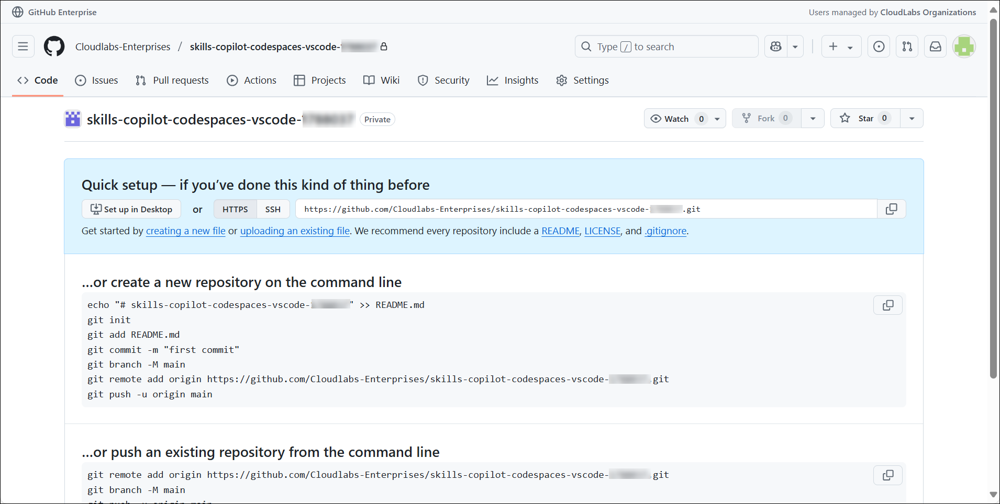
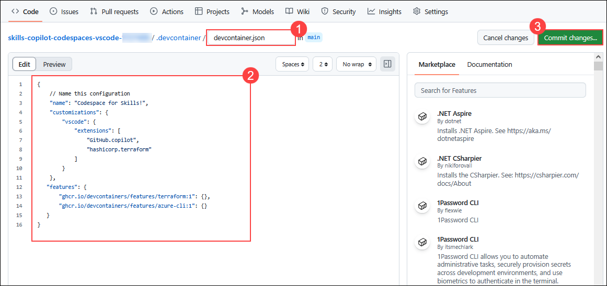
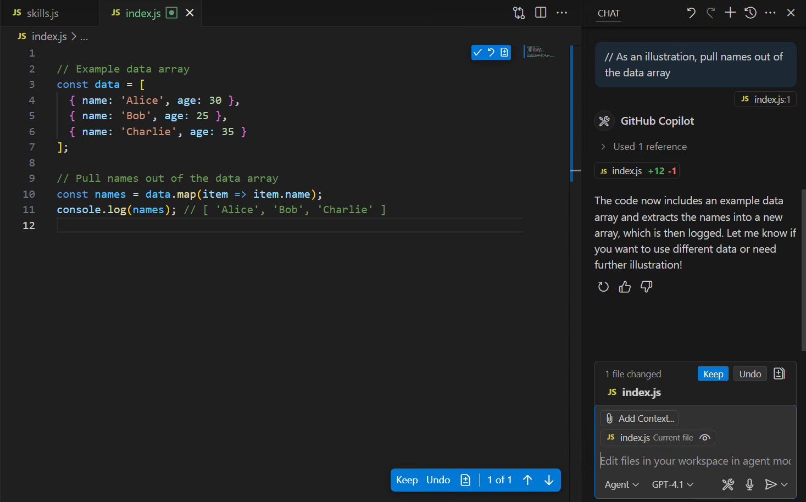
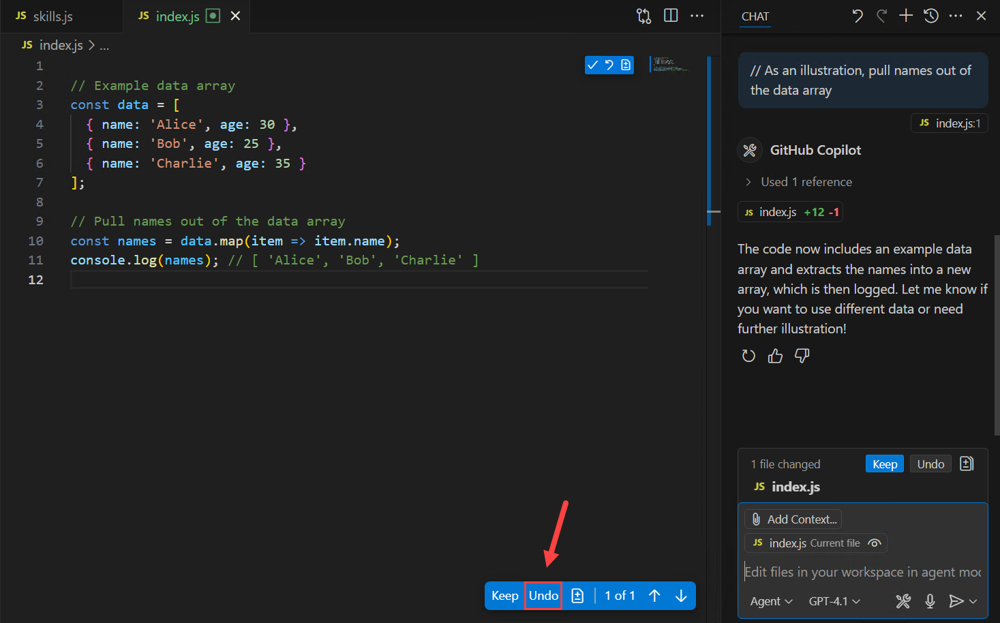
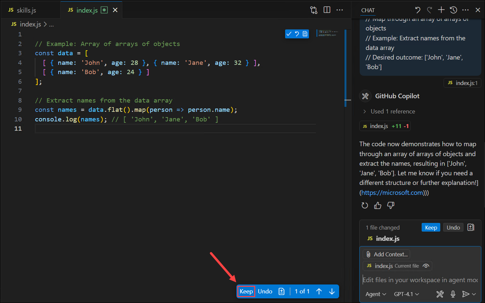

# Hands-On Lab: Code Suggestions with GitHub Copilot in Codespaces using VS Code

## Estimated Duration: 60 Minutes

While GitHub Copilot offers recommendations for many languages and frameworks, it excels in particular when it comes to Python, JavaScript, TypeScript, Ruby, Go, C#, and C++. The samples below are in JavaScript, but they should also work in other languages.

In this lab, you will have the opportunity to experiment with and apply JavaScript with the assistance of GitHub Copilot and GitHub Copilot Chat.

>**Disclaimer**: A whole function body will be automatically suggested by GitHub Copilot in gray text. Here's an example of what you are likely to see; however, the precise recommendation could vary. If you do not see code recommendations, try adding a space after the code. 

## Lab objectives

In this lab, you will complete the following tasks:

- Task 1: Add a JavaScript file and start writing code
- Task 2: Push code to your repository from the codespace
- Task 3: Best practices to use GitHub Copilot

### Task 1: Add a JavaScript file and start writing code

In this task, you'll log into GitHub, create a new repository from a template, configure the development environment using a `.devcontainer` file, and launch a Codespace in Visual Studio Code. Once inside the Codespace, you'll confirm that GitHub Copilot is installed and working by writing a simple JavaScript function and letting Copilot suggest the function body.

1. In the **LABVM** desktop, double-click on **Microsoft Edge**.

   

2. Navigate to the GitHub login page using the provided URL below:
   ```
   https://github.com/login
   ```
   
3. On the **Sign in to GitHub** tab, you will see the login screen. In that screen, enter the following **Username: <inject key="GitHub User Name" enableCopy="true"/>** and then click on **Sign in with your identity provider** **(2)**. 
   
   
          
4. Next, On the **Single sign-on to CLoudLabs Organizations** select **Continue**.

   .png)

5. On the **Sign in** page, enter the following credentials and select **Sign in**. You will be logged into the GitHub Admin page.

    - **Email**: <inject key="AzureAdUserEmail"></inject>
    - **Password**: <inject key="AzureAdUserPassword"></inject>

        >**Note:** First-time users are often prompted to Stay Signed In. If you see any such pop-up, click on **No**.
   
        

6. Copy the link below, then open a new tab in the Edge browser inside the LabVM. Paste the link into the address bar and press Enter. Make sure you're logged into GitHub, as done in the previous steps.

   <!-- For the start course, run in JavaScript:
   'https://github.com/new?' + new URLSearchParams({
     template_owner: 'skills',
     template_name: 'copilot-codespaces-vscode',
     owner: '@me',
     name: 'skills-copilot-codespaces-vscode',
     description: 'My clone repository',
     visibility: 'public',
   }).toString()
   -->

   ```
   https://github.com/new?template_owner=skills&template_name=copilot-codespaces-vscode&owner=%40me&name=skills-copilot-codespaces-vscode&description=My+clone+repository&visibility=public
   ```
 
7. On the Create a new repository page, most fields will be pre-filled. Just update the **Owner** to **Cloudlabs-Enterprises** **(1)** and change the **Repository name** **(2)** as provided below to make it unique.

    - Enter your Repository name as:
    
      ```
      skills-copilot-codespaces-vscode-<inject key="Deployment-id" enableCopy="false"/>
      ```
      
      .png)

    - Click on **Create repository** **(3)** to continue.

      

8. Once the new repository is created, wait for approximately 20 seconds and then refresh the page; you will be redirected to the main page of the **skills-copilot-codespaces-vscode-<inject key="Deployment-id" enableCopy="false"/>**  repository.

      

9. Click on your profile picture from the top right corner and select **Your organizations**.

      .png)

10. From the left navigation pane, select **Codespaces** under **Code, planning and automation**.

      

11. Scroll down and make sure, **Visual Studio Code** is selected, under the **Editor preference**.

     

12. Navigate back to the home page of your repository, click on **creating a new file** under Quick setup.

    .png)

13. Type or paste the following in the empty text field prompt to name your file **(1)**.

      ```
      .devcontainer/devcontainer.json
      ```

14. In the body of the new **.devcontainer/devcontainer.json** file, add the following content **(2)** and click on **Commit changes** **(3)**.

      ```
      {
         // Name this configuration
         "name": "Codespace for Skills!",
         "customizations": {
            "vscode": {
                  "extensions": [
                     "GitHub.copilot",
                     "hashicorp.terraform"
                  ]
            }
         },
         "features": {
            "ghcr.io/devcontainers/features/terraform:1": {},
            "ghcr.io/devcontainers/features/azure-cli:1": {}
         }
      }
      ```

      
   
15. Click the **Commit changes** button.

      

16. Navigate back to your repository, click on the **Code** **(1)** tab located at the top left of the screen. After that, click on the **Code** **(2)** button located in the middle of the page.

      > **Note**: If you don't see the "Create Codespace" button, it likely means your repository wasn't created under the **Cloudlabs-enterprises** organization. To fix this, either delete your current repository and recreate it under the specified organization, or fork the existing repository into **Cloudlabs-enterprises** Org.

        

17. Click the **Codespaces (1)** tab in the pop-up window and then click the **+ (2)** button.
   
      .png)

      >**Note:** If case pop-up prompt doesn't appear in the browser to open Visual Studio Code, manually launch Visual Studio Code from the desktop and close it. Next, return to the browser, refresh the page, and launch the codespace that was previously created.

18. You will encounter a pop-up prompt. Click on **Open** to proceed. 

      

19. Subsequently, another pop-up window will appear within Visual Studio Code (VS Code) **Allow 'GitHub Codespaces' extension to open this URI**, select **Open** to continue.

      .png)

20. When prompted, click **Allow** to let the GitHub Codespaces extension sign in using your GitHub account.

      

      >**Note:** It may take up to 2 minutes for the Codespace to launch.

21. Click on **Continue** to authorize Visual Studio Code with the signed-in account.

      .png)

22. Click on **Authorize Visual-Studio-Code** to grant access.

      .png)

23. Click on **Open** to launch Visual Studio Code and complete the authorization process.

      .png)

24. Verify your codespace is running. Make sure the VS Code looks as shown below:

      .png)

25. Click on **Extensions** **(1)** from the left menu, and the **GitHub Copilot** **(2)** extension should show up in the VS Code extension list. Click the Copilot extension and verify its installation as shown below:

      

      >**Note:** If the GitHub Copilot extension is not installed, click on Install.
      > - Click **Signed Out** at the bottom of the page, then select **Sign in to use Copilot**. When the notification popup appears, click **Sign in** to activate GitHub Copilot in Visual Studio Code for free.
   
      .png)

      .png)

      > - Click **Allow** to let the GitHub Copilot extension sign in using your GitHub account.
      
      .png)

      > - Click on **Continue** to authorize Visual Studio Code with the signed-in GitHub account.

      

      > - Click on **Open** to return to Visual Studio Code and complete the sign-in process.

         
    
24. Click the **New File** icon in the Explorer panel to create a new file in your workspace.

      .png)

25. Name the file `skills.js` and make sure it appears as shown below.

      .png)

26. In the `skills.js` file, type the following function header:

      ```
      function calculateNumbers(var1, var2)
      ```
      
      > **Note:** A whole function body will be automatically suggested by GitHub Copilot in gray text. Here's an example of what you are likely to see; however, the precise recommendation could vary. If you do not see a code recommendation, try adding a space after the code. 
      
      > **Note:** If the suggestions are not visible, close Visual Studio Code and then reopen it. 

      (1).png)

      >**Note:** Suggestions may not be exactly as shown in the picture, but they could be similar.

27. Press `Tab` to accept the suggestions and then press `Ctrl + S` to save the file.

      (1).png)

### Task 2: Push code to your repository from the codespace

In this task, you will use the VS Code terminal to add the `skills.js` file to the GitHub repository.

1. Open VS Code Terminal by clicking on **Ellipsis (...)** **(1)**, select **Terminal** **(2)** and click on **New Terminal** **(3)**.

   .png)

2. Run the below command to add the `skills.js` file to the GitHub repository.

   ```
   git add skills.js
   ```

3. Next, from the VS Code terminal stage, commit the changes to the repository.

   ```
   git commit -m "Copilot first commit"
   ```

4. Finally, from the VS Code terminal, push the code to the repository.

   ```
   git push
   ```

   .png)

   >**Note**: Wait about 60 seconds, then refresh your GitHub repository landing page for the next step.


### Task 3: Best practices to use GitHub Copilot

>**Note**: Verify GitHub Copilot Chat extension is installed in VS Code.

1. To confirm that the GitHub Copilot Chat extension is installed, follow the steps below in Visual Studio Code:

    - Click on the **Extensions (1)** icon in the activity bar present on the left side of the Visual Studio Code Window.
    - In the "Search Extensions in Marketplace" search box, type and search for the **GitHub Copilot Chat (2)** extension.
    - Select **GitHub Copilot Chat (3)** from the list of results that show up, and verify that **GitHub Copilot Chat** has been installed.
    - If not, click on the **Install (4)** button.

      

1. After the installation finishes, you'll see the **GitHub Copilot Chat icon (1)** next to the search bar at the top. To open the chat, click ***Open Chat (2)** as shown below.

   .png)

### Task 3.1- Example: Set the stage with a high-level goal

This is most helpful if you have a blank file or an empty codebase. In other words, it can be quite helpful to set the stage for the AI pair programmer if GitHub Copilot has no idea what you want to build or achieve. It helps to prime GitHub Copilot with a big-picture description of what you want it to generate, before you jump in with the details.

When prompting GitHub Copilot, think of the process as having a conversation with someone: How should I break down the problem so we can solve it together? How would I approach pair programming with this person?

1. From the VS Code Explorer panel, click the **New File** icon to create a new file.

   .png)

2. Name the file `index.js` and verify your new file looks as shown below:

   .png)

3. Now, press **Ctrl + I** to open the GitHub Copilot Chat and paste the following **comments (1)** to create a basic markdown editor and click on the **Send and Dispatch (Enter) (2)** button.

   ```
   Create a basic markdown editor in index.js with the following features:
   - Use React hooks
   - Create a state for markdown with the default text "type markdown here"
   - A text area where users can write markdown 
   - Show a live preview of the markdown text as I type
   - Support for basic markdown syntax like headers, bold, and italics 
   - Use the React markdown npm package 
   - The markdown text and resulting HTML should be saved in the component's state and updated in real-time 
   ```

   .png)

4. This will prompt GitHub Copilot to generate the following code in the image and produce a very simple, unstyled, but functional markdown editor. Now you can clear the contents of the index.js file by clicking on **Accept**, then press **Ctrl + A**, and press **Delete**.

   .png)

   >**Note:** Suggestions may not be exactly as shown in the picture, but they could be similar.


### Task 3.2- Example: Aim to receive a short output from GitHub Copilot for a simple and specific ask

After you've explained your primary objective to the AI pair programmer, explain the reasoning and procedures it must take to reach that objective. This will help GitHub Copilot gain a clearer understanding of your intended outcome when you break things down. For example, imagine you’re writing a recipe. Rather than writing a paragraph outlining the food you intend to make, you would break down the cooking procedure into distinct parts.
So, instead of asking GitHub Copilot to generate a large amount of code at once, let it generate the code after each step.

1. At the top, beside the search bar, click on the **Github Copilot icon** and then open a new chat, enter the below step-by-step instructions for reversing a sentence

    ```
      // take a sentence as input
      // reverse the input sentence
      // the start of the sentence must start with a capital
      // for javascript
    ```

2. The output should resemble the image shown below:

   .png)

   >**Note:** Press **Ctrl + A** to select all the code in the file, then press **Delete** to remove it before proceeding to the next task.

### Task 3.3- Example: Give GitHub Copilot an example or two

1. Not only can people benefit from learning from examples, but so can your AI pair programmer. For example, in order to take the names out of the data array below and put them in a new array:

   .png)

2. Type the below comment in the chat to generate the output without showing an example to GitHub Copilot.

   ```
    // As an illustration, pull names out of the data array  
   ```

3. It has produced an incorrect implementation of the `map` function.

   

4. Click on **Undo** at the bottom to remove the suggested code from `index.js`.

   

4. By contrast, type the following comments to provide an example of how to generate the desired output.

    ```
      // Map through an array of arrays of objects
      // Example: Extract names from the data array
      // Desired outcome: ['John', 'Jane', 'Bob']    
    ```

5. The desired outcome is now visible. To keep the Copilot suggestion in `index.js`, click on **Keep** at the bottom, then press **Ctrl + S** to save the file.

   
   
   >**Note:** Suggestions may not be exactly as shown in the picture, but they could be similar.

6. Open the **New Terminal** to push the code.

7. Run the below command to pull the latest changes.

   ```
   git pull
   ```

8. Run the below command to add the `index.js` file to the GitHub repository.
   
   ```
   git add index.js
   ```

9. Next, from the VS Code terminal, commit the changes to the repository.

   ```
   git commit -m "Copilot commit"
   ```

10. Finally, from the VS Code terminal, push the code to the repository.

      ```
      git push
      ```

      >**Note**: Wait about 60 seconds, then refresh your GitHub repository landing page for the next step.

> **Congratulations** on completing the task! Now, it's time to validate it. Here are the steps:
> - If you receive a success message.
> - If not, carefully read the error message and retry the step, following the instructions in the lab guide. 
> - If you need any assistance, please contact us at cloudlabs-support@spektrasystems.com. We are available 24/7 to help you out.

   <validation step="4beb3a8b-c0f8-4ba4-8115-89d05107f2e5" />
 
### Review

In this lab, you have completed the following:
- Added a JavaScript file and wrote the code.
- Pushed the code to your repository from the codespace.
- Learnt the best practices to use GitHub Copilot.

### You have successfully completed the Hands-on Lab.
